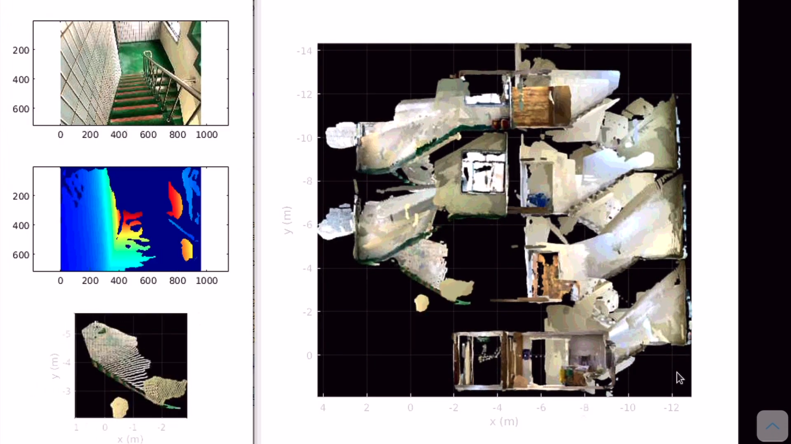

# depth-mapping-matlab
using RTAB-Map iPhone/iPad app data 

## How to use 
- run makeDepthCloudAndGlobalMap.m
- Recommended to see these videos first 
  - 1. [Using RTAB-Map app, run a session](https://www.youtube.com/watch?v=69WoEvwzc14&t=4s)
  - 2. [The keyframe data extraction](https://www.youtube.com/watch?v=WcRcJCH67ds) 
  - 3. and the third step is [this repository](https://www.youtube.com/watch?v=tGMz9Wornag&t=1s) 

## Example 
- [video](https://www.youtube.com/watch?v=tGMz9Wornag&t=1s)
- capture: 

